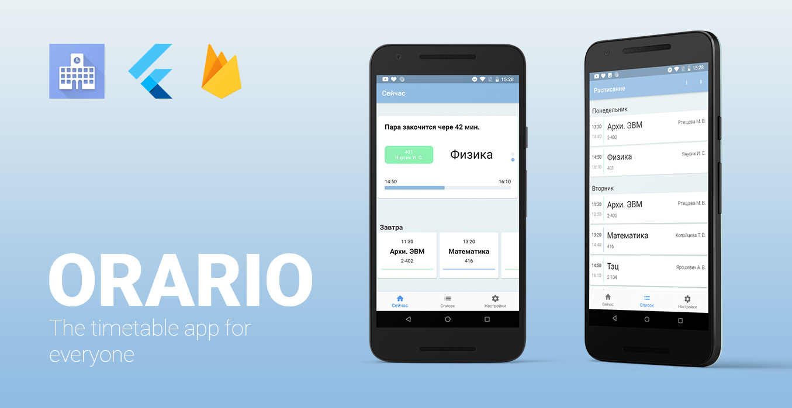

# Orario

The open timetable app.

- Flutter
- Firebase

Version history

    v0.0.1 Alpha
        [x] Welcom screen
        [x] Setup procces
        [x] Settings persistence
        [x] Timetable list view
    
    v0.0.2 Alpha
        [x] Refactoring
        [x] List design
        [x] Complete navigation

    v0.0.3 Beta
        [x] Token system
        [x] Editing system
        [x] Settings screen
		[x] Data persistence
    
    v0.0.4 Beta
		[x] No lesson button
		[x] Add icon and rename app
		[x] List design
		[x] Author tile in settings
		[x] New design for settings
		[x] Time managment
		[x] Home screen under construction etc.
		[>] Design pop-ups and dialogs
		[-] Fix group creation

    v0.0.5 Beta
		[x] Home screen
	   		[x] Home tile
	   		[x] Tomorrow list
		[x] Design pop-ups and dialogs
		[x] Time format bug
		[ ] Silence all warnings
		[x] Change A/B to I/II
		[ ] BNTU has different times
		[x] Sub groups
		[x] Set main as future
		[x>] Shortening fix 
		[x] Start refactoring design
		[x] Default list on time